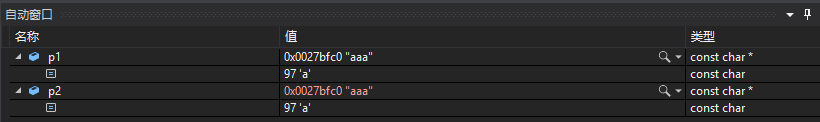
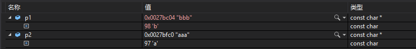
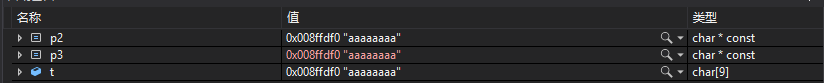
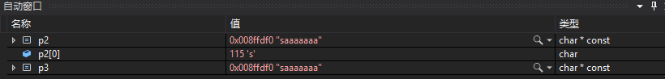

[TOC]
# 1
- const 左结合 左边为空 再右结合
- 所以 const char * s = char const * s
- char * const
# 2
## 2.1
- 指向const对象的指针

- 修改的是指针的指向

```c++
const char * p1 = "aaa";
p1 = "bbb";
cout << p1 << endl;  // p1 = bbb
```

## 2.2

```c++
const char * p1 = "aaa";
const char * p2 = p1;
```



```c++
p1 = "bbb";
```



```c++
cout << p1 << endl;
cout << p2 << endl;
//  p1 = bbb p2 = aaa
```

## 2.3
- 上面的字符串是常量，但是下面的不是常量

- t[]本身不是常量字符串，但是从s的角度来看，s认为自己指向了一个常量字符串，实际上t可以修改

```c++
char t[] = "sss";
const char * s = t;
s[0] = 'q';  // 表达式必须是可修改的左值
t[0] = 'q';
s = qss
```
## 2.4

```c++
char const * p2 = "aaa";
p2 = "bbb";
cout<< p2 << endl;
//  p2 = bbb
```

# 3
- 指针是const类型的 指针指向的对象不能修改，但是可以修改指向对象的内容
## 3.1
> char * const s = "aaaaaaaa";

- "aaaaaaaaaaa":const char * 类型的
## 3.2

```c++
char t[] = "aaaaaaaa";
char * const p2 = t;
p2[0] = 's';
cout << p2 << endl;
// p2 = saaaaaaa
```

## 3.3

```c++
char t[] = "aaaaaaaa";
char * const p2 = t;
char * const p3 = p2;
```



> p2[0] = 's';



# 4

- 对象拷贝时，常量的底层const不能赋值给非常量的底层const；

- 拷入和拷出的对象必须具有相同的底层const资格或者两个对象的数据类型必须能够转换。

## 4.1

```c++
int i = 0;
const int ci = 42;
int &r = ci;  // 错误：普通的int&不能绑定在int常量上
const int &r2 = i;  // 正确：const int&可以绑定在int变量上，但是无法通过r2修改i的值
```


# 参考文献

[C++的顶层const和底层const的理解](https://blog.csdn.net/qq_19528953/article/details/50922303)


