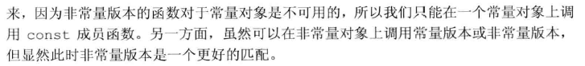
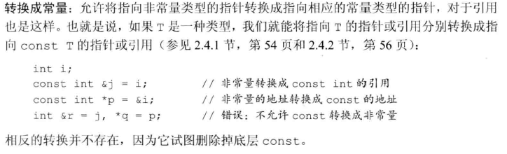
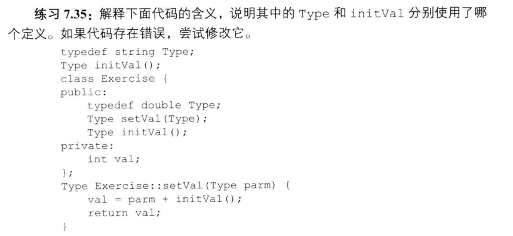
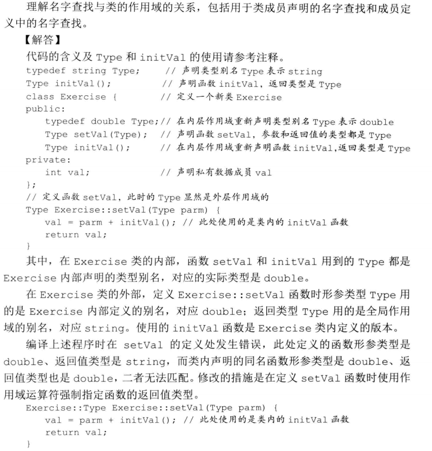

# 第七章

##　7.1 定义抽象数据类型

引用返回左值，调用一个返回引用的函数得到左值，其他返回类型得到右值。（202）

## 7.1.4 构造函数

构造函数不能被声明为 *const* 的，当我们创建类的一个 *const* 对象时，直到构造函数完成初始化过程，对象才能真正取得其“常量属性”。因此，构造函数在 *const* 对象的构造过程中可以向其写值。

## 7.2 访问控制与封装

作为接口的一部分，构造函数和一部分成员函数定于在 *public* 说明符之后，而数据成员和作为实现部分的函数则应该跟在 *private* 说明符之后。

## 7.3.2 返回 \* this 的成员函数

## 7.4.1 名字查找与类的作用域

名字查找 寻找与所用名字最匹配的**声明**的过程

编译器处理完类中全部声明后才会处理成员函数的定义

 成员函数体直至整个类可见后才会被处理，所以能使用类中定义的任何名字

声明中使用的名字，包括返回类型或参数列表中使用的名字，都必须在使用前可见

一般来说，内层作用域可以重新定义外层作用域中的名字，即使该名字在已经在内层作用域使用过；然而在类中，如果成员使用了外层作用域中的某个名字，而该名字代表一种类型，则类不能在之后重新定义该名字

## 习题 7.49

临时对象无法传递给非常量引用，可以传递给常量引用

## 7.6 类的静态成员

*static* 关键字只出现在类内部的声明语句中，在类的外部定义静态成员时，不能重复 *static* 关键字

## 习题 7.35

该习题中类内类外的问题可以参考 *p270* 中的一句话

从类名开始，定义语句的剩余部分都位于类的作用域之内了

[reference](<https://blog.csdn.net/xiaocainiaodeboke/article/details/51873207>)**不仅是构造函数， 所有函数的声明和定义的 默认参数应保持一致， 定义可以不写， 但不能和声明中不同， 最好只在声明中写出默认参数。**

