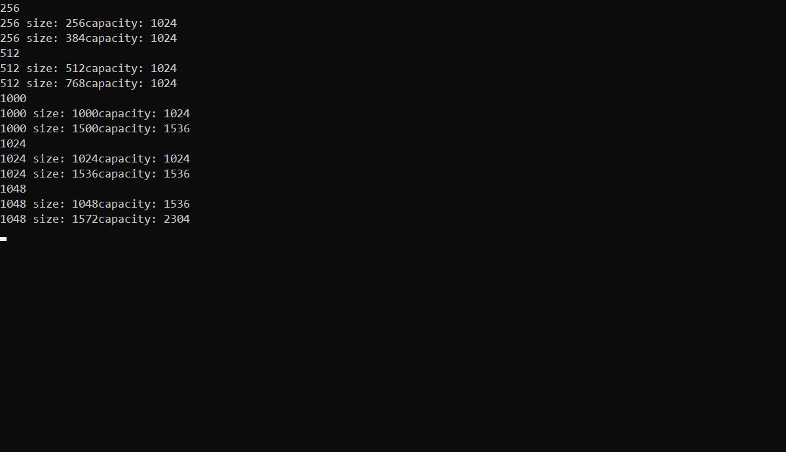

# 第九章 顺序容器

## 9.2 容器库概览

*forward_list* 不支持反向容器的额外成员

## 9.2.4 容器定义和初始化

将一个新容器创建为另一个容器的拷贝的方法有两种： 直接拷贝整个容器； 拷贝由一个迭代器对指定的元素范围（ *array* 除外）

第一种方法两个容器的类型及其元素类型必须匹配， 第二种方法不要求容器类型相同，元素类型也不要求相同， 只要能把拷贝的元素转换为要初始化的容器的元素类型即可

*array* 拷贝还要求大小要一样， 因为大小是 *array* 类型的一部分

## 9.2.5 赋值和 *swap* 

赋值相关运算会导致指向左边容器内部的迭代器、 引用和指针失效， *swap* 操作将容器内容交换不会导致指向容器的迭代器、 引用和指针失效（*array* 和 *string* 除外）

*array* 类型不支持 *assign* ， 也不允许用花括号包围的值列表进行赋值

由于旧元素被替换， 因此传递给 *assign* 的迭代器不能指向调用 *assign* 的容器

除 *array* 外， *swap* 不对任何元素进行拷贝、 删除或插入操作， 因此可以保证在常数时间内完成， 元素不会被移动意味着除 *string* 外， 指向容器的迭代器、 引用和指针在 *swap* 操作之和不会失效， 对一个 *string* 调用 *swap* 会导致迭代器、 引用和指针失效， *swap* 两个 *array* 会真正交换它们的元素， 因此， 交换两个 *array* 所需的时间与元素的数目成正比。

## 9.2.6 容器大小操作

*max_size* 返回一个 **大于或等于** 该类型容器所能容纳的最大元素数的值。

*forward_list* 支持 *max_size* 和 *empty* ， 但不支持 *size* 。

## 9.2.7 关系运算符

关系运算符左右两边的运算对象必须是相同类型的容器， 且必须保存相同类型的元素。

容器的关系运算符使用元素的关系运算符完成比较。

## 9.3.1 向顺序容器添加元素

### 使用 *push_back*

除 *array* 和 *forward_list* 之外， 每个顺序容器都支持 *push_back* 。

### 使用 *push_front*

除 *array* 、 *vector* 和 *string* 之外， 每个顺序容器都支持 *push_front* 。

### 使用 *insert* 

```c++
c.insert(p, t);  // slist.insert(slist.begin(), "Hello!");  // slist.push_back("hello!");
c.insert(p, n, t);  // svec.insert(svec.end(), 10, "Anna");
c.insert(p, b, e);  // slist.insert(slist.begin(), v.end() - 2, v.end());
c.insert(p, il);  // slist.insert(slist.begin(), {"these", "words", "will", "go"});
```

向一个 *vector* 、 *string* 或 *deque* 插入元素会使所有指向容器的迭代器、 引用和指针失效。

*forward_list* 有自己专有版本的 *insert* 。

第四种方法拷贝的范围不能指向与目的位置相同的容器。

```c++
slist.insert(slist.begin(), slist.begin(), slist.end());  // running error
```

在 *p* 之前插入， 返回指向第一个新加入元素的迭代器， 若范围为空， 不插入任何元素， 返回第一个参数。

## 习题 9.20

判断一个数的奇偶性

```c++
int t;
cout << (t % 2 ? true : false);
cout << (t & 1);
```

## 9.3.2 访问元素

*back* 不适用于 *forward_list* 。

*auto* 会忽略掉顶层 *const* ， 同时底层 *const* 会保留下来。

 ## 9.3.3 删除元素

*forward_list* 不支持 *pop_back* ， *vector* 和 *string* 不支持 *pop_front*  。

*erase* 返回指向删除的（最后一个）元素之后位置的迭代器。

## 习题 9.40



每个编译器结果应该不同， 无需深究

