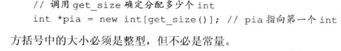

# 第十二章 动态内存与智能指针

## 12.1.2 直接管理内存

动态分配的内存是默认初始化的。

## 7.1.4 构造函数

只有当类没有声明任何构造函数时， 编译器才会自动地生成默认构造函数。

一旦定义了一些其他的构造函数， 那么除非再定义一个默认构造函数， 否则类将没有默认构造函数。

如果一个类再某种情况下需要控制对象初始化， 那么该类很可能在所有情况下都需要控制。

## 12.2.1 new 和数组

