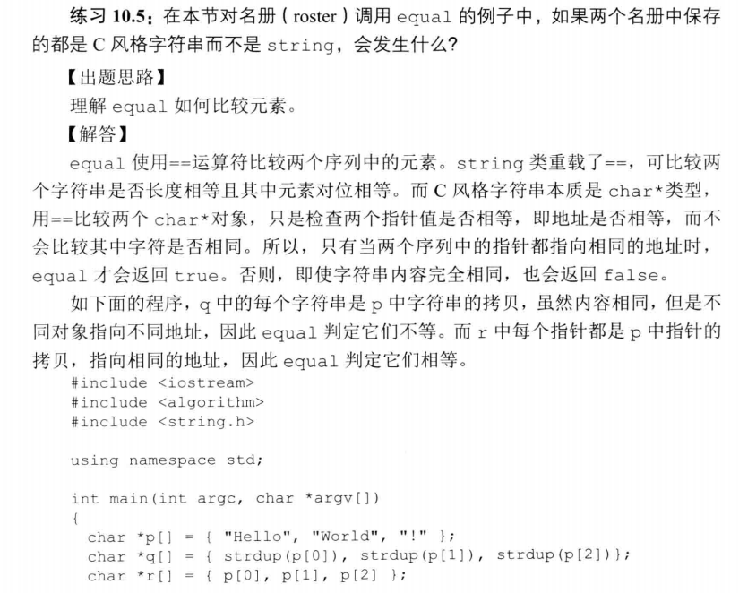
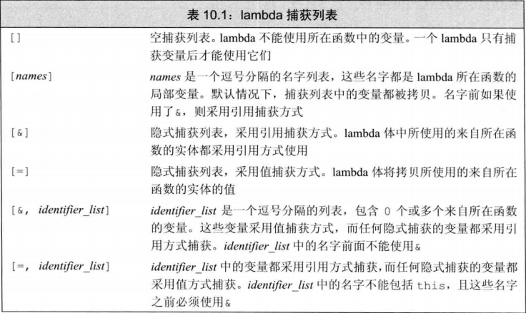
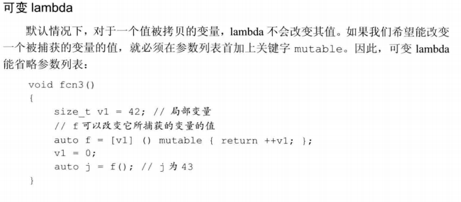
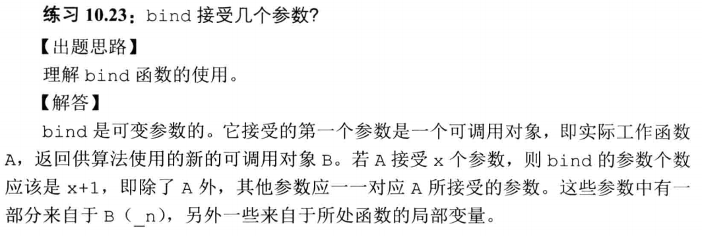

# 第十章

## 10.1 概述

算法永远不会执行容器的操作， 不会改变底层容器的大小， 可能改变容器中保存的元素的值， 可能在容器内移动元素， 但永远不会直接添加或删除元素。

find()

count()

## 10.2 初始泛型算法

###　10.2.1 只读算法

accumulate()

equal()

序列中元素类型必须与第三个参数匹配， 或者能转换为第三个参数的类型。

### 习题 10.4

```c++
vector<double> v;
accumulate(v.cbegin(), v.cend(), 0);  // error
accumulate(v.cbegin(), v.cend(), 0.0);  // error
```

### 习题 10.5



### 10.2.2 写容器元素的算法

fill()

fill_n()

copy()

### 习题10.7

泛型算法通过迭代器操作容器， 不能直接向容器添加、 删除元素， 无法改变容器大小。 如需改变容器大小，需要使用插入器的迭代器 *back_inserter*。

*reserve* 为容器分配足够的内存空间， 但泛型算法对于容器的要求不是足够的空间， 而是足够的元素， 算法不具备向容器添加元素的能力， 插入器有能力向容器中添加元素。

## 10.3.2 lambda 表达式

一个lambda表达式表示一个可调用的代码单元， 一个未命名的内联函数。

可以忽略参数列表和返回类型， 但必须永远包含捕获列表和函数体。

如果函数体只是一个 return 语句， 则返回类型从返回的表达式的类型推断而来， 否则返回类型为 void。

[capture list] (parameter list) -> return type {function body}

lambda 不能有默认参数





## 习题 10.23



## 10.4.3 反向迭代器

不可能从一个 forward_list或一个流迭代器创建反向迭代器

谓词返回可以转换为bool类型的值的函数